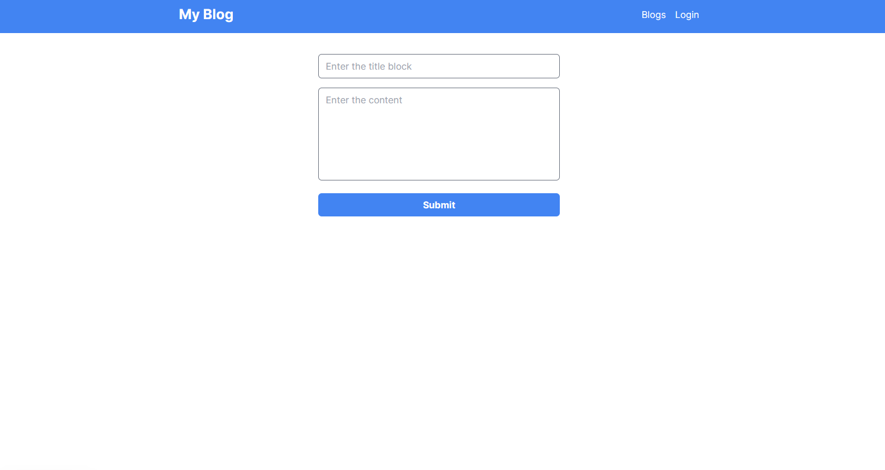
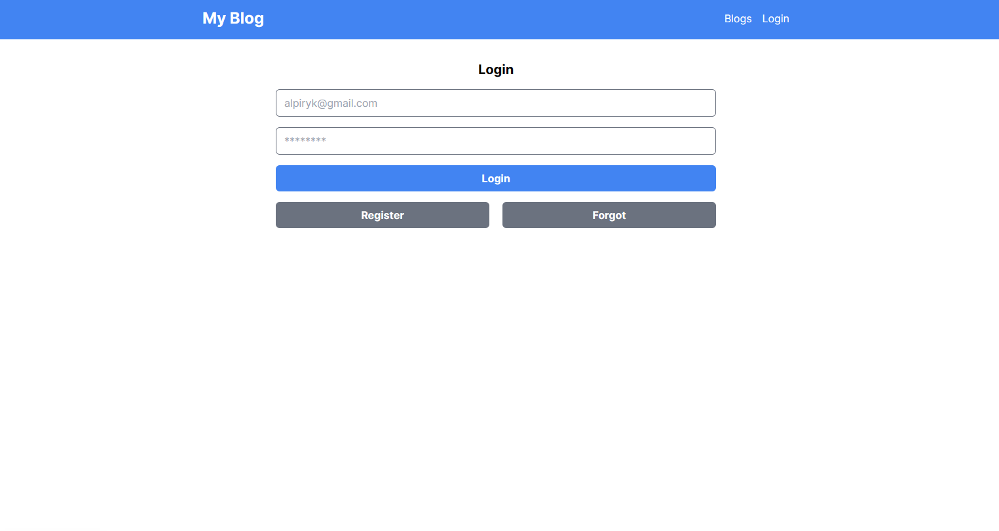
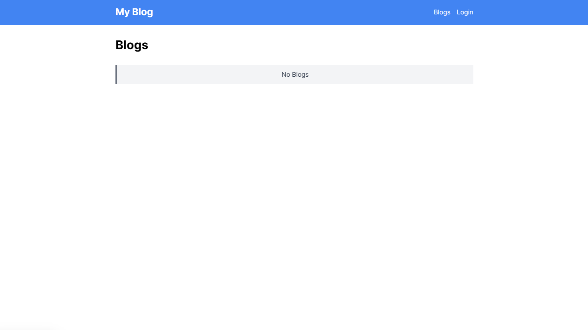

# Blog Interactivo: Creación, Comentarios y Seguridad

Project completed: A dynamic blog built from scratch with Next.js, Tailwind CSS, Node.js and Express. It includes a robust system of user registration, content publishing, commenting and viewing without registration. Explore the code in my GitHub repository and learn more about this multifunctional project!

## Tech Stack

**Client:** Nextjs, React, TailwindCSS

**Server:** Node, Express, Sequelize, SQL


## Screenshots






## Run Locally

Clone the project

```bash
  git clone https://github.com/XxElInmortalXx/NextFlow-MySQL-Lab/tree/main/proyectos/01_learning
```

Go to the project directory

```bash
  cd 01_learning
```

## Run Frontend

```bash
  cd frontend
```

Install dependencies

```bash
  npm install
```

Start the server

```bash
  npm run dev
```

## Run Backend

```bash
  cd backend
```

Install dependencies

```bash
  npm install
```

Start the server

```bash
  npm run dev
```


## Features

- Secure user registration
- Password security
- Content publishing
- Comments on posts


## Environment Variables

To run this project, you will need to add the following environment variables to your .env file

`DB_NAME`
`DB_USER`
`DB_PASS`
`DB_HOST`

`EMAIL_HOST`
`EMAIL_PORT`
`EMAIL_USER`
`EMAIL_PASS`

`JWT_SECRET`

`CLIENT_URL`


## Authors

- [@Andres Eduardo Rosas Alpiri](https://github.com/XxElInmortalXx)


## Acknowledgements

 - [Candra Kriswinarto](https://www.linkedin.com/in/candra-kriswinarto/)
